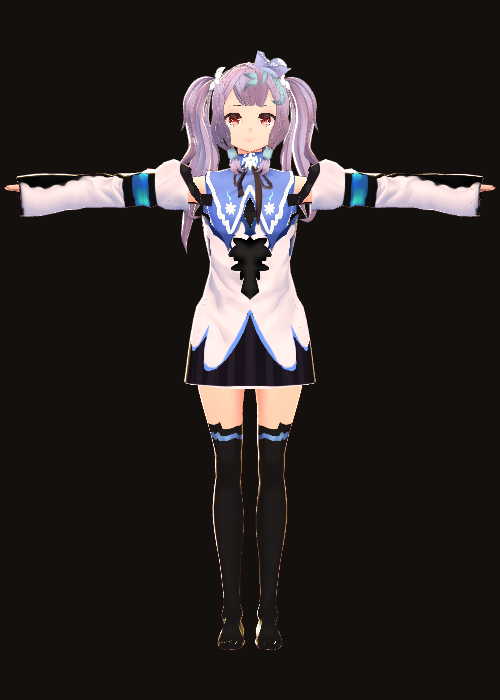
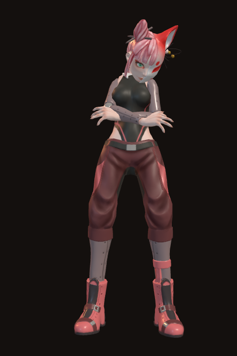
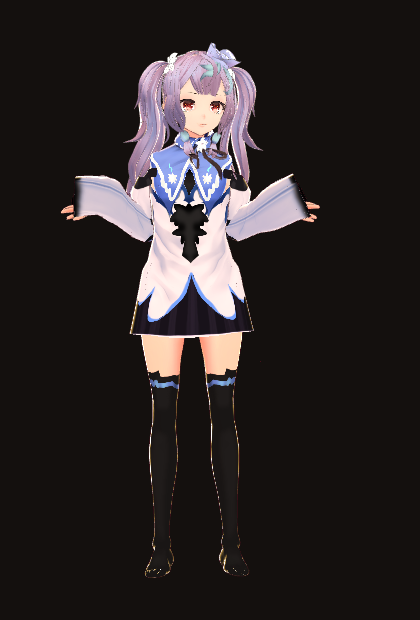

# Kitsune Companion

A Windows desktop **and Android** assistant with a 3D fox-girl character. She listens, answers
out loud and in text, and keeps a Markdown memory file you can read and edit.

Her name is **Rin**. She is a seven-tailed kitsune who has decided your computer
is her territory, and she is touchy about the missing two tails.

---

## What it does

**Screen 1 — Companion**

- The character rendered in 3D, with idle motion, blinking, breathing, mouth
  movement while she speaks, and eyes that follow your cursor.
- A text box for typing.
- **Hold to talk** — press and hold the button, or hold <kbd>Space</kbd>, and
  speak. The recording is transcribed and sent as your message.
- Replies arrive as text in the transcript *and* are spoken aloud.
- She picks a mood for each reply, which drives a matching body-language
  animation.

**Screen 2 — Personality & Memory**

- **Personality** — the full system prompt in an editable box. Rewrite her tone,
  her rules, even her name; it applies to the next message. One click restores
  the original.
- **Memory** — the Markdown file she reads before every reply and writes to with
  her `remember` / `update_memory` / `forget` tools. Rendered as Markdown, with
  an edit mode. Delete a line to make her forget it.
- **Google & Gemini** — sign-in and model settings.
- **Avatar** — install a different character, or point her at any `.vrm`.
- **Voice** — pick a system voice, rate, pitch, volume.

---

## Requirements

- **Desktop:** Windows 10 or 11 (x64)
- **Android:** Android 7.0 (API 24) or newer, with Google Play services
- Node.js 20+ to build either from source
- A Google account

---

## Setting up the Google connection

Rin talks to Gemini using **your Google account over OAuth**. There is no API
key anywhere in this app — the credential is an OAuth token tied to your
account, stored encrypted on your machine via Electron's `safeStorage`.

Google still needs to know *which application* is asking, so you create a free
OAuth client once. It takes about two minutes.

1. Open <https://console.cloud.google.com/apis/credentials> and pick or create a
   project.
2. Enable the **Generative Language API** for that project.
   (Or the **Vertex AI API** if you want the Vertex backend instead.)
3. **Create credentials → OAuth client ID → Application type: Desktop app.**
4. Copy the client ID into **Personality & Memory → Google & Gemini** and press
   **Sign in with Google**.

Your browser opens, you approve, and the app catches the redirect on a loopback
port. The client secret field is optional — the flow uses PKCE.

### Which backend?

| | Gemini API (default) | Vertex AI |
|---|---|---|
| Billing | Not required — free tier | Requires a billed Cloud project |
| Setup | Enable one API | Enable API, set project + location |
| Auth | Your Google account | Your Google account |

Both are OAuth-only in this app. Neither uses an API key.

> **A note on what changed.** Google shut down the Gemini CLI "Login with
> Google" path for individual accounts on 18 June 2026, so that specific route
> no longer works. The two backends above are the supported ways to reach Gemini
> with a Google account and no API key, which is why the app uses them. Some
> third-party plugins re-use Antigravity's OAuth client to get free quota; this
> app deliberately does not, because it breaks Antigravity's terms and has been
> getting accounts blocked.

---

## Android

There is an Android build of the same app — same React tree, same 3D stage, same
persona and memory format, in a Capacitor shell instead of Electron. Sign-in
necessarily differs (Google closed the desktop-style redirect to Android apps),
so it uses Play Services' Authorization API: still your Google account, still no
API key.

```sh
npm run sync:android     # build the web bundle and copy it into android/
npm run open:android     # open in Android Studio, then Run
```

**[docs/ANDROID.md](docs/ANDROID.md)** has the full setup, including the one
required step — registering an Android OAuth client with your signing
certificate's SHA-1 — and an honest account of what could not be verified (no
APK was built here; the Android SDK host is blocked in this environment).

## Install and run

```sh
npm install        # also downloads the avatar and animations
npm run dev        # run in development
npm run build      # typecheck + bundle
npm run test       # unit tests
npm run package:win  # build the Windows installer into release/

npm run build:mobile # Android web bundle
npm run sync:android # copy it into the Android project
```

`npm run package:win` produces an NSIS installer,
`release/Kitsune Companion-1.0.0-Setup.exe`. Run it on Windows; building the
installer itself must be done on Windows (or under Wine).

---

## The 3D character

The avatar is an **existing model that gets installed, not generated**. Assets
live in `assets/` and are downloaded by `scripts/fetch-assets.mjs`, which runs
automatically after `npm install`. They are not committed — the avatar alone is
~18 MB, and the sources are public-domain downloads rather than project source.

| Asset | Source | Licence |
|---|---|---|
| **Megan the Fox** (default) | Polygonal Mind, 100 Avatars R3 | CC0-1.0 |
| **響狐リク / Hibiki Fox Riku** (VTuber) | Original VRoid character, [Booth](https://booth.pm/en/items/1148939) | check source page |
| **Two-Tails** (alternative) | Polygonal Mind, 100 Avatars R3 | CC0-1.0 |
| VRoid sample girl (fallback) | pixiv VRoid Studio sample | CC0-1.0 |

The three foxes sit on independent hosts and are tried in order, so a network
that blocks one may still reach another. Where a licence could not be read from
a machine-readable source, the app labels the entry **licence unverified** and
links to the author's page rather than asserting terms on their behalf.
| `idle.vrma` | pixiv ChatVRM | MIT |
| 11 expression clips | `tk256ailab/vrm-viewer` | MIT |

Rendering is [`@pixiv/three-vrm`](https://github.com/pixiv/three-vrm) on
three.js. Animation clips are VRM Animation (`.vrma`) files retargeted onto
whichever avatar is loaded, so swapping the character keeps every animation
working.

### Verifying an avatar

`tools/render.mjs` loads a `.vrm` in headless Chromium through the same
three.js + `@pixiv/three-vrm` stack the app uses and writes a PNG. See
`tools/README.md`. The images in `docs/preview/` came from it, and they are how
the animation retargeting was checked: the avatar's bounding box narrows from
1.06 m wide in the T-pose to ~0.42 m once a VRMA clip is applied, which is the
arms coming down.

| T-pose (no clip) | `thinking.vrma` | `farewell.vrma` |
|---|---|---|
|  |  |  |

### If the fox avatar is missing

The fox avatars are hosted on Arweave. On a restricted network those mirrors may
be unreachable, in which case the installer falls back to the CC0 VRoid sample
so the app always starts with a working character, and the Companion screen
shows a **stand-in avatar** badge.

To fix it, open **Personality & Memory → Avatar** and press **Install & use** on
Megan the Fox, or point the app at any `.vrm` file you already have.

> **Why the fox is not committed to this repository.** The environment this was
> built in routes all outbound traffic through an allowlisting proxy, which
> denies `arweave.net`, every IPFS gateway, `booth.pm`, `hub.vroid.com`,
> `itch.io` and Hugging Face. Only GitHub, GitLab and the npm registry are
> reachable, and every redistributable fox-girl VRM that could be found lives
> behind one of the blocked hosts. Twelve CC0/MIT avatars that *are* reachable
> were downloaded and rendered to check — none of them is a fox.
>
> So the animation pack and the fallback avatar are verified end to end, and the
> fox download is the one path that could not be exercised here. The code around
> it is ordinary: mirrors tried in order, glTF magic-byte validation, atomic
> rename, and the in-app installer shares it.
>
> Searching VTuber sources specifically did pay off: the
> [Lobe Vidol](https://github.com/lobehub/lobe-vidol-market) character market
> turned up 響狐リク, an original VRoid fox girl, on a host independent of
> Arweave. She is in the catalog as the second fox to try. Her CDN is blocked
> here too, but she is unlikely to be blocked wherever Arweave is.

### Using your own VTuber avatar

Any VRM works. VRoid Hub and Booth are full of VTuber-style kitsune avatars —
download one in a browser and load it with **Personality & Memory → Avatar →
Use a .vrm file from my computer**. Every animation retargets onto whatever
humanoid rig it finds, so nothing else needs changing.

### Animations

`idle` runs continuously. Each reply's mood swaps in a clip and a facial
expression, held for about seven seconds before easing back to idle:

`neutral → idle`, `happy → clapping`, `thinking`, `surprised`, `sad`, `angry`,
`sleepy`, `blush`, `proud → relax`, `playful → jump`, `curious → look around`,
`farewell → goodbye`.

On top of the clips, the renderer adds randomised blinking, cursor-following
gaze, and viseme-driven mouth movement synchronised to the speech synthesiser.

---

## How a turn works

```
you type, or hold Space and speak
        │
        ├─ audio ─→ main ─→ Gemini (transcription) ─→ text
        │
        ▼
   main builds the request:
     system instruction = personality file + memory file
     tools = remember / update_memory / forget
        │
        ▼
     Gemini ──(function calls)──→ memory.md is edited ──→ Gemini
        │
        ▼
   reply text + [mood: …] tag
        │
        ├─→ transcript (Markdown)
        ├─→ system voice (flattened for speech)
        └─→ avatar animation + expression
```

Everything that touches your account or your files happens in the main process.
The renderer never sees a token and has no network access of its own — its
content-security policy allows `self` and the private asset scheme only.

---

## Project layout

```
src/
  core/            platform-neutral logic shared by both builds
    gemini.ts      request/tool loop, dependencies injected
    memory-doc.ts  pure Markdown editing for the memory file
    prompt.ts      system instruction, mood parsing, speech flattening
  main/            Electron main process
    auth/          Google OAuth (PKCE loopback), encrypted token storage
    ai/            Gemini client, prompt assembly, mood parsing
    assets/        avatar catalog, downloader, path resolution
    store/         settings, personality and memory files
    ipc.ts         typed IPC surface, every call returns a Result
  preload/         contextBridge API (desktop side of the platform contract)
  mobile/          Capacitor side of the same contract, for Android
  renderer/        React UI, shared verbatim by both shells
    vrm/           three.js + VRM stage, animation director, lip sync
    voice/         speech synthesis, push-to-talk recorder
    screens/       the two screens
  shared/          api.ts (the platform contract), types, channel names
resources/         default personality, default memory, model catalog
scripts/           asset installer
test/              unit tests
```

## Where your data lives

Under `%APPDATA%\Kitsune Companion\`:

- `persona.md` — the personality
- `memory.md` — the memory file
- `settings.json` — preferences
- `credentials.bin` — OAuth tokens, encrypted with `safeStorage`
- `assets/` — avatars you install from the app

Nothing is uploaded anywhere except the Gemini request itself.

---

## Licence

MIT for the application code. Bundled assets keep their own licences, listed in
the table above and in `resources/model-catalog.json`.
