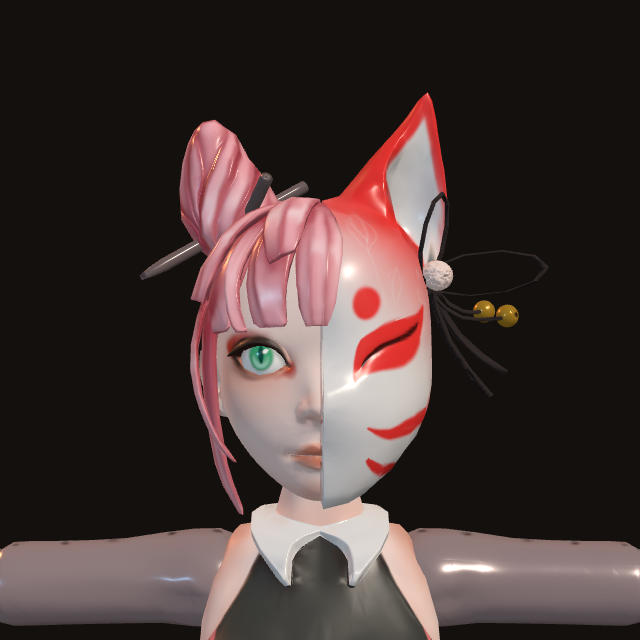
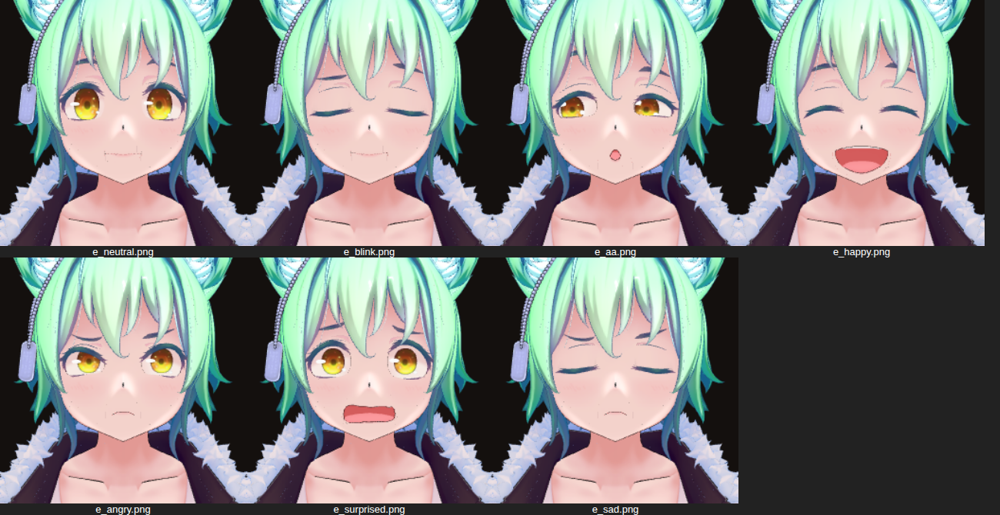

# Kitsune Companion

A Windows desktop **and Android** assistant with a 3D fox-girl character. She listens, answers
out loud and in text, and keeps a Markdown memory file you can read and edit.

Her name is **Rin**. She is a seven-tailed kitsune who has decided your computer
is her territory, and she is touchy about the missing two tails.

---

## What it does

**Screen 1 — Companion**

- The character rendered in 3D, with idle motion, blinking, breathing, mouth
  movement while she speaks, and eyes that follow your cursor.
- A text box for typing.
- **Hold to talk** — press and hold the button, or hold <kbd>Space</kbd>, and
  speak. The recording is transcribed and sent as your message.
- Replies arrive as text in the transcript *and* are spoken aloud.
- She picks a mood for each reply, which drives a matching body-language
  animation.

**Screen 2 — Personality & Memory**

- **Personality** — the full system prompt in an editable box. Rewrite her tone,
  her rules, even her name; it applies to the next message. One click restores
  the original.
- **Memory** — the Markdown file she reads before every reply and writes to with
  her `remember` / `update_memory` / `forget` tools. Rendered as Markdown, with
  an edit mode. Delete a line to make her forget it.
- **Google & Gemini** — sign-in and model settings.
- **Avatar** — install a different character, or point her at any `.vrm`.
- **Voice** — pick a system voice, rate, pitch, volume.

---

## Requirements

- **Desktop:** Windows 10 or 11 (x64)
- **Android:** Android 7.0 (API 24) or newer, with Google Play services
- Node.js 20+ to build either from source
- A Google account

---

## Setting up the Google connection

Rin talks to Gemini using **your Google account**. There is no API key anywhere
in the app; the credential is an OAuth token tied to your account, stored
encrypted via Electron's `safeStorage`.

Open **Personality & Memory → Google & Gemini** and press **Set up
automatically**. The app then:

1. signs you in through your browser,
2. finds your Google Cloud project,
3. switches the Gemini API on for it,
4. makes a test call to prove it worked.

Each step reports its own progress, and a failing one explains what happened
and offers the page that fixes it.

The one thing you install yourself is the
**[Google Cloud CLI](https://cloud.google.com/sdk/docs/install)** — a normal
installer. The app drives it so that sign-in happens against Google's own OAuth
client, which is what removes the need to create a project, configure a consent
screen and paste a client ID. If you have ever run
`gcloud auth application-default login`, the app finds those credentials and
setup is instant.

### Doing it by hand instead

If you would rather not install the CLI, expand **Set it up by hand instead**.
That path wants an OAuth client of type **Desktop app**, and a brand-new project
also needs its **consent screen** configured first — that step is the one that
usually trips people up, and the panel links straight to it.

### Which backend, and what it costs

| | Cost | Setup |
|---|---|---|
| **Gemini API** (default) | **Free.** No card, no billing account. | Press *Set up automatically* |
| **Local model (Ollama)** | **Free.** Runs on your machine, offline. | Install Ollama, pull a model |
| Vertex AI | **Paid** — needs a billed Cloud project | Project ID + location |

On the default Gemini API backend nothing can charge you. The free tier gives
you Flash models with no payment method attached, and when you hit the rate
limit **requests fail rather than being billed** — there is no card to charge.
Creating a Google Cloud project is also free; a project is just a container, and
the automatic setup only switches the Gemini API on inside it.

Two honest caveats. Free-tier traffic may be used by Google to improve their
products, and Pro models moved behind billing in May 2026, so the free tier is
Flash-only. If either matters to you, use the local backend.

### Running fully offline and free

Pick **Local model (Ollama)** under *Model → Backend*, or press **Use a local
model instead** in the sign-in panel, and Rin answers from a model on your own
machine. No account, no network, no quota, nothing to bill.

Once it is selected the panel says whether Ollama is actually answering and
which models you have pulled, so a missing install or an empty model list shows
up there rather than as a failed message.

```sh
# install Ollama from https://ollama.com, then:
ollama pull llama3.2
```

Set the model name in Settings and press *Refresh list* to see what you have
pulled. Her personality, her memory file, the memory tools and the mood-driven
animation all work exactly the same — the provider is the only thing that
changes.

The one thing it cannot do is **hold-to-talk**. A local text model has no audio
input, so speech recognition still needs Gemini; the button is disabled and says
so rather than failing. Her *voice* is unaffected either way: replies are spoken
by the Windows system voice, which is local and free regardless of backend.

## Install and run

```sh
npm install        # also downloads the avatar and animations
npm run dev        # run in development
npm run build      # typecheck + bundle
npm run test       # unit tests
npm run package:win  # build the Windows installer into release/

npm run build:mobile # Android web bundle
npm run sync:android # copy it into the Android project
```

### Getting the app onto a phone

You do not need Android Studio, or an Android SDK, or anything on your machine
at all. Every push builds an APK on GitHub:

1. Open the repository's **Actions** tab and pick the newest **Android APK** run.
2. Download the artifact at the bottom — `kitsune-companion-<commit>`.
3. Unzip it and copy `app-debug.apk` to your phone.
4. Open it there. Android will ask you to allow installs from that source; it is
   a debug build, so it is unsigned by any store.

First launch downloads the avatar and the animation clips (about 15 MB), so give
it a moment on a connection.

`npm run package:win` produces an NSIS installer,
`release/Kitsune Companion-1.0.0-Setup.exe`. Run it on Windows; building the
installer itself must be done on Windows (or under Wine).

---

## The 3D character

The avatar is an **existing model that gets installed, not generated**. Assets
land in `assets/` via `scripts/fetch-assets.mjs`, which runs automatically after
`npm install`: the default character is copied out of the repository, everything
else is downloaded.

| Asset | Source | Licence |
|---|---|---|
| **Shibahu** — fox girl (default) | Supplied by the repository owner, `anime-fox-girl/` on `main` | check with the owner |
| **Anna** — kitsune girl | Polygonal Mind, 100 Avatars R3 #270 | CC0-1.0 |
| **Megan the Fox** | Polygonal Mind, 100 Avatars R3 #278 | CC0-1.0 |
| **響狐リク / Hibiki Fox Riku** (VTuber) | Original VRoid character, [Booth](https://booth.pm/en/items/1148939) | check source page |
| **Two-Tails** | Polygonal Mind, 100 Avatars R3 #284 | CC0-1.0 |
| VRoid sample girl (fallback) | pixiv VRoid Studio sample | CC0-1.0 |
| `idle.vrma` | pixiv ChatVRM | MIT |
| 11 expression clips | `tk256ailab/vrm-viewer` | MIT |

Shibahu is **committed to this repository** at
`resources/avatars/shibahu-fox-girl.vrm`, so `npm install` copies her into place
with no network at all. The rest are downloaded from independent hosts and tried
in order. Where a licence could not be read from a machine-readable source, the
app labels the entry **licence unverified** and links to the source rather than
asserting terms on anyone's behalf.

### Rin



Mint-green hair, gold slit-pupil eyes, bell-tipped fox ears and a tail.

She arrived as a Blender file, not a VRM — a 210-bone rig with no humanoid map,
which `@pixiv/three-vrm` cannot retarget anything onto. `tools/blend-export.py`
and `tools/glb-to-vrm.mjs` convert her: 52 humanoid bones mapped, and her
seventeen unnamed facial morphs identified by rendering each one and bound to
the VRM expression names the stage drives.



*neutral · blink · `aa` · happy — then angry · surprised · sad.*

So she blinks, lip-syncs while speaking and changes face with her mood, the same
as a purpose-built VRM would.

Rendering is [`@pixiv/three-vrm`](https://github.com/pixiv/three-vrm) on
three.js. Animation clips are VRM Animation (`.vrma`) files retargeted onto
whichever avatar is loaded, so swapping the character keeps every animation
working.

### Verifying an avatar

`tools/render.mjs` loads a `.vrm` in headless Chromium through the same
three.js + `@pixiv/three-vrm` stack the app uses and writes a PNG. See
`tools/README.md`. The images in `docs/preview/` came from it, and it is how
every avatar in the catalog was checked — both that it is really a fox, and
that the animation clips retarget onto it.

| T-pose (no clip) | `thinking.vrma` | `farewell.vrma` |
|---|---|---|
|  |  |  |


### If the fox avatar is missing

It should not be: the default is committed to the repository and copied into
place, so it needs no network. If `assets/models/` is empty, run `npm run
assets` and read what it prints.

Should even that fail, the installer works down the rest of the catalog and
finally to the CC0 VRoid sample, so the app always starts with a working
character — the Companion screen then shows a **stand-in avatar** badge. Open
**Personality & Memory → Avatar** to install another fox, or point the app at
any `.vrm` on your machine.

> **A note on how the fox was sourced.** The environment this was built in
> routes outbound traffic through an allowlisting proxy that denies
> `arweave.net`, every IPFS gateway, `booth.pm`, `hub.vroid.com`, `itch.io` and
> Hugging Face — which is where almost every published VRM lives. Anna was found
> by searching GitHub itself for repositories that commit their VRM assets, and
> she is served from `raw.githubusercontent.com`, which *is* reachable. Every
> candidate was rendered with `tools/render.mjs` before being accepted, because
> metadata lies: a file called `Kitsune.vrm` turned out to be a schoolgirl, and
> a `fox.vrm` turned out to be a girl whose ears are drawn by the host app
> rather than stored in the model.

### Using your own VTuber avatar

Any VRM works. VRoid Hub and Booth are full of VTuber-style kitsune avatars —
download one in a browser and load it with **Personality & Memory → Avatar →
Use a .vrm file from my computer**. Every animation retargets onto whatever
humanoid rig it finds, so nothing else needs changing.

### Animations

`idle` runs continuously. Each reply's mood swaps in a clip and a facial
expression, held for about seven seconds before easing back to idle:

`neutral → idle`, `happy → clapping`, `thinking`, `surprised`, `sad`, `angry`,
`sleepy`, `blush`, `proud → relax`, `playful → jump`, `curious → look around`,
`farewell → goodbye`.

On top of the clips, the renderer adds randomised blinking, cursor-following
gaze, and viseme-driven mouth movement synchronised to the speech synthesiser.

---

## How a turn works

```
you type, or hold Space and speak
        │
        ├─ audio ─→ main ─→ Gemini (transcription) ─→ text
        │
        ▼
   main builds the request:
     system instruction = personality file + memory file
     tools = remember / update_memory / forget
        │
        ▼
     Gemini ──(function calls)──→ memory.md is edited ──→ Gemini
        │
        ▼
   reply text + [mood: …] tag
        │
        ├─→ transcript (Markdown)
        ├─→ system voice (flattened for speech)
        └─→ avatar animation + expression
```

Everything that touches your account or your files happens in the main process.
The renderer never sees a token and has no network access of its own — its
content-security policy allows `self` and the private asset scheme only.

---

## Project layout

```
src/
  core/            platform-neutral logic shared by both builds
    gemini.ts      request/tool loop, dependencies injected
    memory-doc.ts  pure Markdown editing for the memory file
    prompt.ts      system instruction, mood parsing, speech flattening
  main/            Electron main process
    auth/          Google OAuth (PKCE loopback), encrypted token storage
    ai/            Gemini client, prompt assembly, mood parsing
    assets/        avatar catalog, downloader, path resolution
    store/         settings, personality and memory files
    ipc.ts         typed IPC surface, every call returns a Result
  preload/         contextBridge API (desktop side of the platform contract)
  mobile/          Capacitor side of the same contract, for Android
  renderer/        React UI, shared verbatim by both shells
    vrm/           three.js + VRM stage, animation director, lip sync
    voice/         speech synthesis, push-to-talk recorder
    screens/       the two screens
  shared/          api.ts (the platform contract), types, channel names
resources/         default personality, default memory, model catalog
scripts/           asset installer
test/              unit tests
```

## Where your data lives

Under `%APPDATA%\Kitsune Companion\`:

- `persona.md` — the personality
- `memory.md` — the memory file
- `settings.json` — preferences
- `credentials.bin` — OAuth tokens, encrypted with `safeStorage`
- `assets/` — avatars you install from the app

Nothing is uploaded anywhere except the Gemini request itself.

---

## Licence

MIT for the application code. Bundled assets keep their own licences, listed in
the table above and in `resources/model-catalog.json`.
